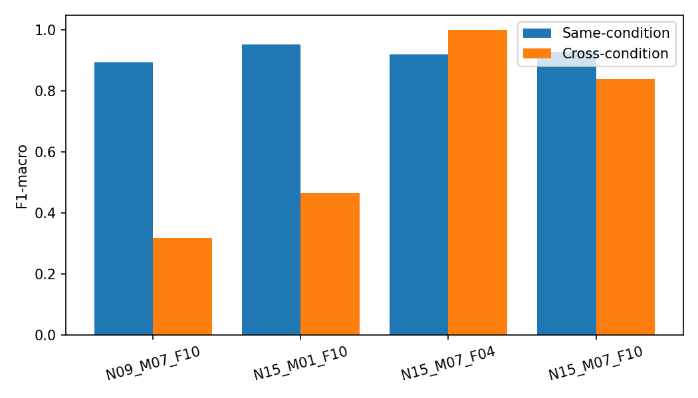
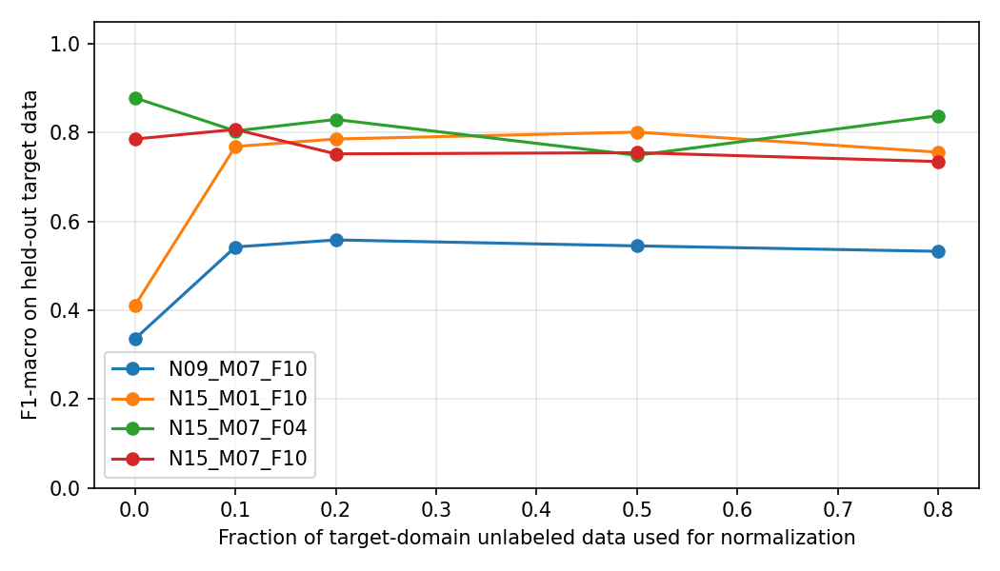
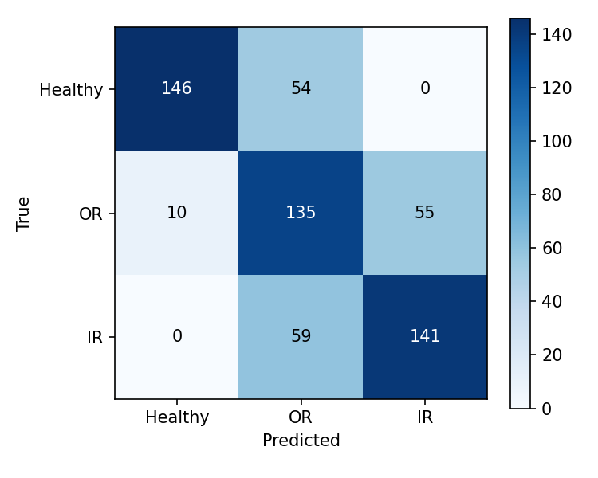

# Paderborn 电机轴承故障诊断：跨工况泛化与域适应

> 本项目基于开源仓库 [Dingding1996/bearing-fault-diagnosis](https://github.com/Dingding1996/bearing-fault-diagnosis)（MIT License）完成。
> 原仓库提供数据下载、信号加载、DSP 特征提取和基础 ML 流程；**本文档重点记录我在其基础上完成的跨工况泛化、域适应和目标域数据预算实验**。

---

## 1. 项目背景

- 数据：Paderborn University KAt-DataCenter（[Zenodo DOI 10.5281/zenodo.15845309](https://zenodo.org/records/15845309)）
- 信号：两相电流 + 振动加速度，采样率 **64 kHz**
- 轴承：本项目使用 **15 个真实损伤轴承**（5 健康 K001–K005、5 外圈 KA04/KA15/KA16/KA22/KA30、5 内圈 KI04/KI14/KI16/KI18/KI21）
- 工况：4 种（N09_M07_F10、N15_M01_F10、N15_M07_F04、N15_M07_F10）
- 任务：正常 / 外圈故障 / 内圈故障 三分类

## 2. 方法

1. **特征提取**（复用原仓库 `utils/dsp_features.py`）：
   - 时域：RMS、峰值、峭度、峰值因子、偏度等；
   - 频域：谱重心、PSD 频带能量、主频等；
   - 时频：小波包分解（WPD）子带能量；
   - 包络：BPFO/BPFI 幅值与比值（振动信号，带通 + Hilbert 包络）。
2. **分类基线**：随机森林（RandomForest，class_weight=balanced）。
3. **严格验证**：按轴承分组交叉验证（同一轴承不会同时出现在训练和测试）。
4. **跨工况实验**：用部分工况训练，在未见工况上测试，量化域偏移。
5. **域适应**：
   - Domain z-score：训练域、目标域分别做 z-score（目标域只用无标签数据估计均值/方差）；
   - CORAL：对齐目标域协方差到训练域（结果不佳，见下）。
6. **目标域数据预算**：只使用 10%/20%/50%/80% 的无标签目标数据估计统计量，在剩余目标数据上评估。

## 3. 主要结果

### 3.1 同工况 vs 跨工况（600 样本，随机森林）

| 测试工况 | Same-condition F1 | Cross-condition F1 |
|---|---|---|
| N09_M07_F10（900 rpm） | 0.894 | **0.318** |
| N15_M01_F10（0.1 Nm） | 0.954 | **0.466** |
| N15_M07_F04（400 N） | 0.920 | 1.000（工况相近） |
| N15_M07_F10 | 0.930 | 0.841 |



### 3.2 域适应对比（跨工况）

| 测试工况 | Baseline F1 | Domain z-score F1 | CORAL F1 |
|---|---|---|---|
| N09_M07_F10 | 0.318 | **0.717** | 0.304 |
| N15_M01_F10 | 0.466 | **0.884** | 0.549 |
| N15_M07_F04 | 1.000 | 0.966 | 0.415 |
| N15_M07_F10 | 0.841 | **0.860** | 0.405 |

### 3.3 目标域数据预算（F1 vs 无标签目标数据比例）

| 测试工况 | 0% | 10% | 20% | 50% | 80% |
|---|---|---|---|---|---|
| N09_M07_F10 | 0.335 | **0.542** | **0.558** | 0.545 | 0.532 |
| N15_M01_F10 | 0.410 | **0.768** | **0.785** | 0.801 | 0.756 |
| N15_M07_F04 | **0.878** | 0.804 | 0.829 | 0.749 | 0.838 |
| N15_M07_F10 | **0.785** | 0.807 | 0.752 | 0.754 | 0.735 |



### 3.4 基线混淆矩阵



## 4. 结论

1. 同工况下模型表现良好（F1≈0.90），但跨工况显著退化（最低 0.32）；
2. **Domain z-score** 对困难跨工况有效，将 F1 从 0.32→0.72、0.47→0.88；
3. **CORAL 在本设置下失效**：145 维特征、目标样本少，协方差估计不稳定，需先降维/特征选择；
4. 目标域数据预算实验表明：**困难工况只需 10–20% 无标签目标数据即可恢复大部分性能**；
5. 对相似工况，盲目适配反而有害（0.878→0.804），应采用**基于域偏移的按需适配**。

## 5. 我的贡献 vs 原仓库

| 部分 | 来源 |
|---|---|
| 数据下载脚本、`.mat` 加载、DSP 特征提取 | 原仓库（MIT） |
| 基础 ML pipeline / notebook | 原仓库（MIT） |
| 跨工况评估（同工况 vs 跨工况，按轴承分组） | **我的工作** |
| Domain z-score / CORAL 域适应对比 | **我的工作** |
| 目标域数据预算实验（0–80%） | **我的工作** |
| 结果分析、结论、README | **我的工作** |

## 6. 如何复现

```bash
git clone <your-fork-url>
cd bearing-fault-diagnosis
python -m venv .venv
# Windows
.venv\Scripts\activate.bat
# Linux/macOS
# source .venv/bin/activate

pip install -r requirements.txt
```

下载 3 个轴承做冒烟测试（约 0.5GB）：

```bash
python experiments/00_download_paderborn.py --repo . --bearings K001 KA04 KI04
```

下载最小集（15 个轴承，约 2.4GB）：

```bash
python experiments/00_download_paderborn.py --repo . --minimal
```

运行基线：

```bash
python experiments/01_baseline_rf.py --repo . --set minimal --no-download --per-condition 10
```

跨工况评估：

```bash
python experiments/03_cross_condition_eval.py --repo . --set minimal --no-download --per-condition 10
```

域适应对比：

```bash
python experiments/04_domain_adaptation.py --repo . --set minimal --no-download --per-condition 10
```

目标域数据预算：

```bash
python experiments/05_target_budget.py --repo . --set minimal --no-download --per-condition 10
```

## 7. 局限与后续工作

- 仅使用 15 个轴承、公开数据集，尚未接入真实硬件；
- 域适应为特征级统计对齐，后续可尝试信号级归一化、域偏移检测（MMD/CORAL distance）、域对抗/迁移学习；
- CORAL 需先做特征选择/PCA 或加强正则化；
- 后续计划：STM32 + LIS3DH 采集实测振动数据，用同一特征流程做推理，与公开数据结果对比。

## 8. 引用与许可

- 原仓库：[Dingding1996/bearing-fault-diagnosis](https://github.com/Dingding1996/bearing-fault-diagnosis)，MIT License；
- 数据集：Lessmeier et al., "Condition Monitoring of Bearing Damage in Electromechanical Drive Systems by Using Motor Current Signals of Electric Motors: A Benchmark Data Set for Data-Driven Classification", PHME 2016；Zenodo DOI 10.5281/zenodo.15845309；
- 本项目中的扩展代码采用 MIT License（与原仓库一致），请保留原仓库版权声明和数据集引用。
