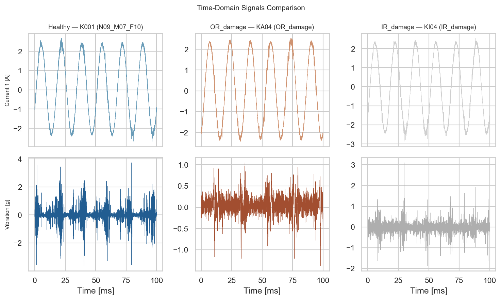
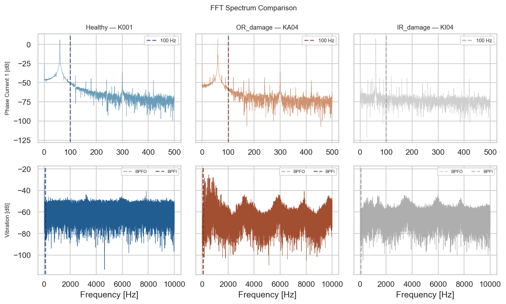
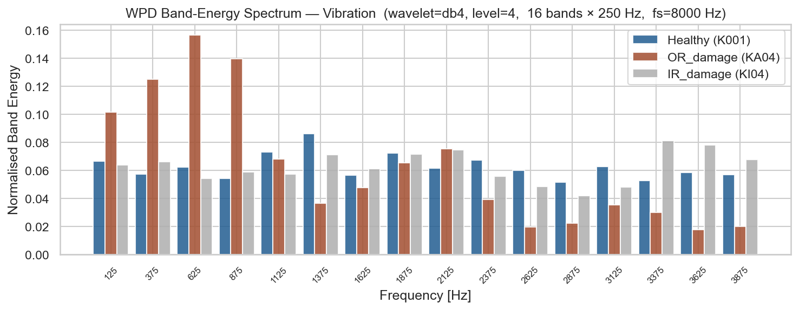
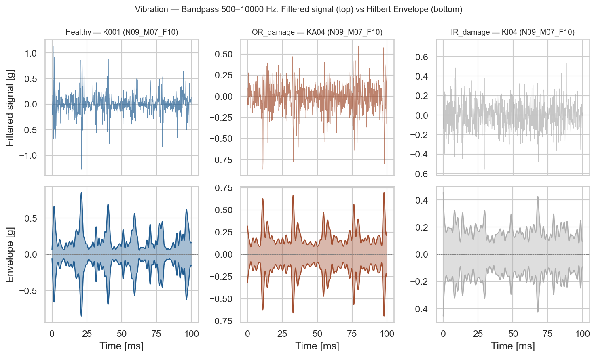
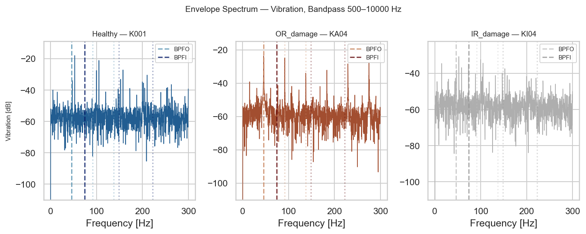
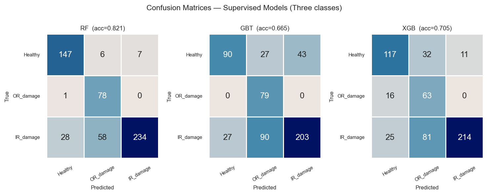
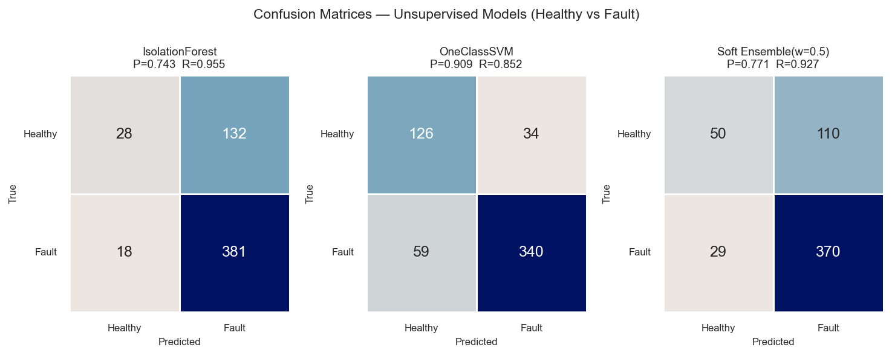
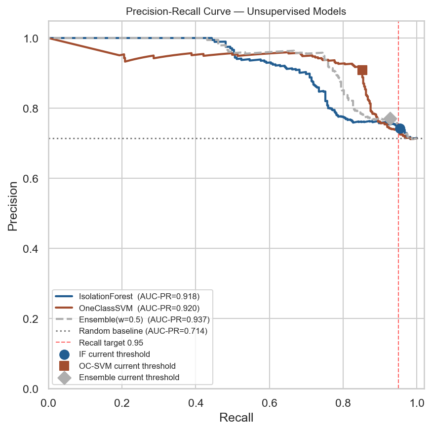
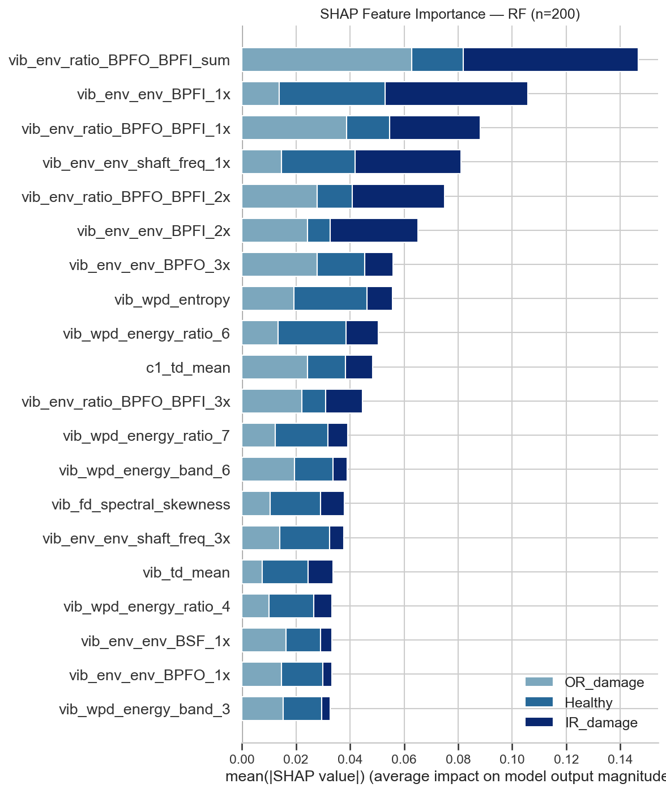

# Bearing Fault Diagnosis via Motor Vibration and Current Signals

End-to-end predictive maintenance case study based on CRISP-DM methodology. Covers bearing fault detection in electric drive systems — from raw signal processing and feature engineering, through classical ML-based anomaly detection, to cloud deployment.


---

## Business Understanding

**Common fault signatures in electric drive systems:**

| Component | System | Fault type | Vibration signature | Current signature |
|---|---|---|---|---|
| Bearing | Motor / drivetrain | Surface spalling / crack | Bearing characteristic frequencies (BPFO/BPFI); envelope analysis most effective | Not prominent |
| Rotor | Motor | Imbalance | 1× shaft frequency dominant | Not prominent |
| Rotor | Motor | Broken bar | Shaft frequency harmonics increase | ±2sf sidebands around supply frequency, very prominent |
| Stator | Motor | Turn-to-turn short | Not prominent | Three-phase current asymmetry, specific harmonics |
| Air gap | Motor | Static eccentricity | Shaft-frequency-related harmonics | Specific harmonics |
| Air gap | Motor | Dynamic eccentricity | Shaft-frequency-related harmonics | Rotating sidebands |
| Coupling | Drivetrain | Misalignment | 2× shaft frequency prominent, high axial vibration | Not prominent |
| Gear | Drivetrain | Wear / broken tooth | Mesh frequency (speed × tooth count) and harmonics | Not prominent |
| Shaft | Drivetrain | Bend / crack | 1× and 2× shaft frequency anomalies | Not prominent |

> This project focuses on **bearing faults**.

**Why this matters.**
Problem: *"Does this bearing need attention?"*

Undetected bearing faults cause unplanned downtime, while excessive false alarms create unnecessary
maintenance costs. Both missed faults and false alarms carry real costs, so **F1** is used as the
primary metric.

**What are we detecting?**
Bearing faults produce impulsive spikes in vibration and current signals. Vibration envelope analysis
is the most effective detection method; current signals are insensitive to bearing faults (sidebands
are extremely weak).

Goal 1: classify signals as Healthy, Outer Race damage (OR damage), or Inner Race damage (IR damage).

Goal 2: classify signals as Healthy vs Fault (binary).

**Success metrics defined upfront:**
- Multi-class: F1-macro ≥ 0.85 on held-out bearings
- Binary fault detection (supervised): F1 ≥ 0.95 on held-out bearings, balancing false alarms and missed faults
- Binary fault detection (unsupervised): F1 ≥ 0.80, validating that fault signatures are genuine anomalies

---

## Data Understanding

- **Source**: Paderborn University KAt-DataCenter — [Zenodo DOI 10.5281/zenodo.15845309](https://zenodo.org/records/15845309)
- **Paper**: Lessmeier et al., PHME 2016
- **Signals**: Dual-phase current (64 kHz) + vibration acceleration (64 kHz)
- **Bearings**: 32 experiments — 6 healthy, 12 artificially damaged, 14 real damage
- **Operating conditions**: 4 combinations of speed / torque / radial force
- **Class distribution**: ~19% Healthy, ~40% OR damage, ~41% IR damage

**Key data challenges addressed:**
- Same bearing at different operating conditions produces different signal distributions even when healthy → per-condition z-score normalisation applied before feature extraction
- Labels are available (supervised task), but unsupervised methods validate that fault signatures are genuine anomalies, not learned class boundary artefacts

---

## Feature Engineering

**Operating conditions** — the dataset covers 4 fixed settings, each a combination of shaft speed,
load torque, and radial force:

| Setting code | Speed | Torque | Radial force |
|---|---|---|---|
| N15_M07_F10 | 1500 rpm | 0.7 Nm | 1000 N |
| N09_M07_F10 | 900 rpm | 0.7 Nm | 1000 N |
| N15_M01_F10 | 1500 rpm | 0.1 Nm | 1000 N |
| N15_M07_F04 | 1500 rpm | 0.7 Nm | 400 N |

The same bearing under different conditions produces different signal amplitudes and spectral content
even when healthy — a model trained on N15 without normalisation would misclassify N09 signals as anomalies.
A two-stage pipeline addresses this before any feature is computed.

**Stage 1 — Signal-level z-score normalisation (before feature extraction)**

Each raw signal is standardised using the mean and standard deviation computed from
*training bearings only*, grouped by operating condition:

```
sig_norm(t) = ( sig(t) − μ_cond ) / σ_cond
```

`μ_cond` and `σ_cond` are estimated on training data only — no test-set statistics leak in.
Because fault energy contributes < 10 % of total signal power, the baseline is essentially
fault-free and generalises well to unseen bearings. After this step, a high RMS value
reflects a genuine mechanical anomaly rather than a high-load operating point.

**Stage 2 — Shaft-order conversion (after feature extraction)**

Spectral features (spectral centroid, peak frequency, spectral variance) are expressed in Hz
and scale linearly with shaft speed. Dividing by the shaft frequency `f_shaft = rpm / 60`
converts them to dimensionless shaft orders, so the same fault pattern produces the same
feature value regardless of operating speed. BPFO/BPFI envelope amplitudes are
also computed at the speed-corrected characteristic frequency for each file individually.

| Feature group | Raw unit | After Stage 2 |
|---|---|---|
| Spectral centroid, peak frequency, spectral std | Hz | shaft orders (÷ f_shaft) |
| Spectral variance | Hz² | orders² (÷ f_shaft²) |
| Envelope amplitudes, time-domain stats, WPD ratios | dimensionless | unchanged |

**DSP feature extraction:**

| Domain | Feature | What it measures |
|---|---|---|
| Time | RMS (Root Mean Square) | Overall signal energy — first metric to rise as a bearing degrades |
| Time | Peak | Maximum absolute amplitude — sensitive to sudden large transients |
| Time | Kurtosis | Impulsiveness of the signal — healthy bearing ≈ 3, faulty bearing > 10; best early fault indicator |
| Time | Crest factor | Peak ÷ RMS — rises when isolated spikes appear against a low background |
| Time | Skewness | Asymmetry of the amplitude distribution — healthy signals are near-symmetric |
| Time | Shape factor | RMS ÷ mean absolute value — measures how "spiky" the waveform is relative to its average |
| Time | Impulse factor | Peak ÷ mean absolute value — amplifies single large impulses; sensitive to early pitting faults |




| Domain | Feature | What it measures |
|---|---|---|
| Frequency | Spectral centroid | Weighted average frequency — shifts upward as fault energy moves to higher frequencies |
| Frequency | PSD (Power Spectral Density) band energies | Signal power in specific frequency bands — load-invariant when expressed as ratios |
| Frequency | Dominant frequency | Frequency of maximum energy — detects new periodic components introduced by a fault |
| Frequency | WPD (Wavelet Packet Decomposition) sub-band energies | Signal energy in equal-width frequency sub-bands — captures how fault energy distributes across the spectrum without needing exact defect frequencies |





| Domain | Feature | What it measures |
|---|---|---|
| Envelope (vibration only) | BPFO / BPFI amplitudes (1×–3× harmonics) | Strength of each defect frequency in the demodulated envelope — directly quantifies fault impulse repetition rate |
| Envelope (vibration only) | Inter-frequency ratios (BPFO/BPFI) | Ratio of outer-race to inner-race energy — primary discriminator between OR and IR damage types |






**Bearing defect frequencies (SKF 6203 @ 1500 rpm, 25 Hz shaft):**

| Abbreviation | Full name | Frequency | Physical meaning |
|---|---|---|---|
| BPFO | Ball Pass Frequency, Outer race | 76.1 Hz | How often a rolling element strikes an outer-race defect |
| BPFI | Ball Pass Frequency, Inner race | 123.9 Hz | How often a rolling element strikes an inner-race defect |

**Formulae:**

$$BPFO = \frac{N}{2} \cdot f_n \cdot \left(1 - \frac{d}{D}\cos\theta\right)$$

$$BPFI = \frac{N}{2} \cdot f_n \cdot \left(1 + \frac{d}{D}\cos\theta\right)$$

where: N = number of rolling elements, $f_n$ = shaft frequency (rev/s), d = ball diameter, D = pitch circle diameter (diameter of the circle through the ball centres), θ = contact angle

**Key DSP techniques:**

| Technique | Full name | Purpose |
|---|---|---|
| FFT / PSD | Fast Fourier Transform / Power Spectral Density | Converts time signal to frequency spectrum; identifies dominant fault frequencies |
| WPD | Wavelet Packet Decomposition | Splits signal into equal-width frequency sub-bands for energy analysis |
| Hilbert transform | — | Extracts the signal envelope; exposes the repetition rate of fault impulses |
| STFT | Short-Time Fourier Transform | Sliding FFT window — tracks how the frequency content changes over time |
| CWT | Continuous Wavelet Transform | Multi-resolution time-frequency map; resolves both fast transients and slow trends |

**Feature selection**: `SelectFromModel` with a Random Forest and median importance threshold.

---

## Modeling

**Split strategy** — bearing-aware to prevent identity leakage:
`StratifiedGroupKFold` ensures no bearing spans train and test. A model that sees bearing K001
in training must not see K001 signals in validation — otherwise it memorises bearing-specific
noise rather than learning fault patterns that generalise to unseen assets. Using bearing ID as
the group forces each fold's validation set to contain only bearings never seen during training,
giving a true measure of generalisation.

**Note on time-series splitting:** Each `.mat` file in this dataset is an independent steady-state
recording; each bearing's damage state is fixed and does not evolve over time, so chronological
splitting is not required here. In **run-to-failure** datasets (which record the full degradation
trajectory from healthy to failure), training on earlier data and testing on later data is mandatory
— random splitting lets the model "see the future" during training, inflating test scores that
collapse immediately in deployment. sklearn's `TimeSeriesSplit` handles this scenario: each fold's
validation set is strictly later than the training set, with the training window growing fold by
fold to replicate real rolling-forecast evaluation.

**Model selection:**

| Label availability | Model | Rationale |
|---|---|---|
| Labels available | RF, GBT, XGBoost | Supervised, full 3-class and binary |
| No labels | Isolation Forest + PCA | One-class, trained on healthy only; detects faults via anomaly score |
| No labels | One-Class SVM + PCA | Kernel method learns a tight boundary around the healthy distribution; complements IF with higher precision |
| No labels (ensemble) | AND fusion (IF ∩ OC-SVM) | Fault only when both models agree — sharply reduces false alarms; suited for high false-alarm-cost scenarios |

**sklearn Pipeline**:
All preprocessing (StandardScaler) and model steps are wrapped in a single `Pipeline` object.
The scaler is fit only on training data inside each CV fold — no leakage possible.

**Hyperparameter tuning**: `RandomizedSearchCV` (30 iterations, 3-fold inner CV) for RF, GBT,
XGBoost. Manual `ParameterGrid` + `StratifiedGroupKFold` for Isolation Forest and One-Class SVM
(unsupervised estimators do not accept `y` in `fit`, so `GridSearchCV` cannot be used directly).

---

## Evaluation

**Binary results — Healthy vs Fault** (Section 6):

| Type | Model | Precision | Recall | **F1** |
|---|---|---|---|---|
| Supervised | RF | 0.966 | 0.927 | **0.946** |
| Supervised | XGBoost | 0.893 | 0.897 | **0.895** |
| Supervised | GBT | 0.842 | 0.932 | **0.885** |
| Unsupervised | One-Class SVM | 0.909 | 0.852 | **0.880** |
| Unsupervised | Isolation Forest | 0.743 | 0.955 | **0.836** |
| Unsupervised (fusion) | AND Ensemble (IF ∩ OC-SVM) | ↑ Precision | ↓ Recall | see notebook |

**Primary metrics**:
**F1** is used as the core metric throughout.

Both unsupervised models are trained on healthy samples only with no fault labels.





**Threshold selection and operating-point adjustment:**
Unsupervised model thresholds are selected from the test-set PR curve — among all thresholds
meeting the recall target, the one with maximum precision is chosen as the operating point.
AND fusion takes the intersection of both models' predictions, significantly reducing false alarms
at the cost of some recall. The `FUSION_MODE` constant in the notebook switches between
`'and'`, `'or'`, and `'soft'` (score-weighted blend) fusion strategies with a single change.


**Explainability (SHAP):**
SHAP `TreeExplainer` decomposes each test-set prediction into per-feature contributions, showing how
much each DSP feature pushed the model toward Healthy, OR_damage, or IR_damage — computed on `X_test`
only, never on training data, so the explanation itself can't leak information the model didn't
actually use to predict. The top-ranked features are dominated by **envelope-based ratios**
(`vib_env_ratio_BPFO_BPFI_*`) and **BPFI envelope amplitudes** — consistent with the domain theory
that inner-race impulse rate and the outer/inner energy ratio are the primary discriminators between
OR and IR damage (see Feature Engineering above).



---

## Model Deployment

**MLflow** — experiment tracking and model registry. Every training run logs parameters,
F1-macro, and the best pipeline. The registered model is loaded by the inference service at startup.

**FastAPI** — new `.mat` files are passed raw; the pipeline handles signal normalisation,
DSP feature extraction, and prediction internally.

**Docker / local edge deployment** — the FastAPI service is packaged in a Docker container and
runs as a self-contained service on your own machine, demonstrating the same deployment path a
real edge device would use.

**CI** — GitHub Actions runs the unit test suite on every push.

All deployment artefacts (Dockerfile, compose file, inference dependencies) live in
[`deployment/`](deployment/).

### Quick Start

```bash
# Training
conda activate ds-py311
pip install -r requirements.txt
jupyter lab BearingFault_Training.ipynb   # downloads data automatically if missing
```

**Local / edge inference (requires training notebook to have been run first):**

```bash
docker compose -f deployment/docker-compose.yml up --build
# → http://localhost:8000          (simple upload page)
```
---

## Project Structure

```
bearing-fault-diagnosis/
├── BearingFault_Training.ipynb   # End-to-end CRISP-DM pipeline (DSP → ML → MLflow)
├── requirements.txt              # Pinned training dependencies
├── deployment/                   # Everything needed to run the inference service locally
│   ├── Dockerfile                # FastAPI inference service container
│   ├── docker-compose.yml        # Local / edge deployment (mounts mlruns/, port 8000)
│   └── requirements-inference.txt   # Minimal inference dependencies (Docker)
├── .github/workflows/
│   └── ci.yml                    # Unit tests + deployment smoke test on every push
├── utils/
│   ├── download_dataset.py       # Zenodo dataset downloader
│   ├── data_loader.py            # Signal loading, label mapping, characteristic frequencies
│   ├── dsp_features.py           # DSP feature extraction pipeline (+ self_check())
│   ├── ml_classification.py      # sklearn Pipeline + StratifiedGroupKFold training
│   ├── inference_api.py          # FastAPI service
│   ├── plot_style.py             # Consistent figure styling
│   └── test_features.py          # DSP feature extraction unit tests
└── mlruns/                       # MLflow tracking + model registry
```

---

## Next Steps

- **Run-to-failure datasets**: apply to datasets recording the full bearing degradation trajectory (e.g. FEMTO, PRONOSTIA) with `TimeSeriesSplit` validation; explore remaining useful life (RUL) estimation based on trend prediction
- **Cross-condition generalisation**: train on one operating condition, evaluate on another — the harder and more realistic deployment test
- **Improve unsupervised precision**: introduce more healthy bearing samples or semi-supervised methods (a small number of labelled fault examples) to address the structural false-alarm ceiling of the current one-class approach
- **Distribution shift monitoring**: track PSI on rolling feature windows in production; trigger retraining when PSI > 0.2

---

## References

1. Lessmeier, C., et al. (2016). "Condition Monitoring of Bearing Damage in Electromechanical Drive Systems by Using Motor Current Signals of Electric Motors: A Benchmark Data Set for Data-Driven Classification." *PHME 2016*.
